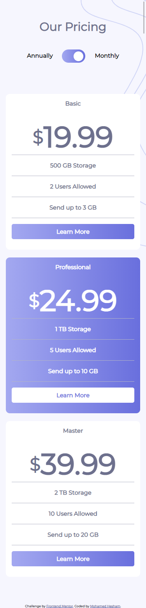
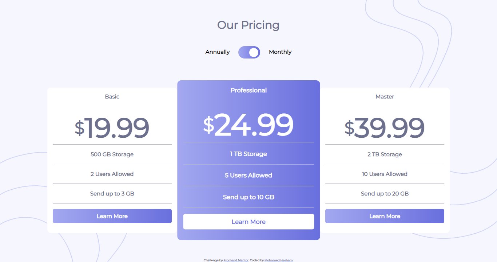

# Frontend Mentor - Pricing component with toggle solution

## Overview

### Screenshot

#### mobile 375px

#### desktop 1440px

### Links

- Solution URL: [solution](https://www.frontendmentor.io/solutions/html-and-cssflexbox-and-javascript-toggle-classes-933V8pjfR)
- Live Site URL: [live preview](https://mohamedhesham221.github.io/pricing-component-with-toggle-master/)

## My process

### Built with

- Semantic HTML5 markup
- CSS custom properties
- Flexbox
- Mobile-first workflow
- Javascript

## Author

- Website - [Mohamed Hesham]
- Frontend Mentor - [@mohamedhesham221](https://www.frontendmentor.io/profile/mohamedhesham221)
- Linkedin - [Mohamed Hesham](https://www.linkedin.com/in/mohamed-hesham-b7611618a/)

